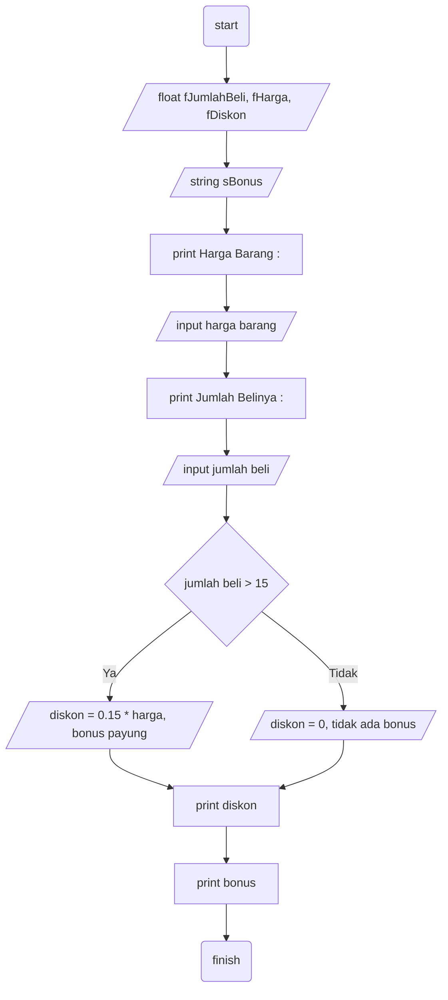

```mermaid
  flowchart TD;
  A(start) --> B[/float fJumlahBeli, fHarga, fDiskon/];
  B --> C[/string sBonus/];
  C --> D[print Harga Barang : ];
  D --> E[/input harga barang/];
  E --> F[print Jumlah Belinya : ];
  F --> G[/input jumlah beli/];
  G --> H{jumlah beli > 15};
  H --Ya--> I[/diskon = 0.15 * harga, bonus payung/];
  H --Tidak--> J[/diskon = 0, tidak ada bonus/];
  I --> K[print diskon];
  J --> K;
  K --> L[print bonus];
  L --> M(finish);
```